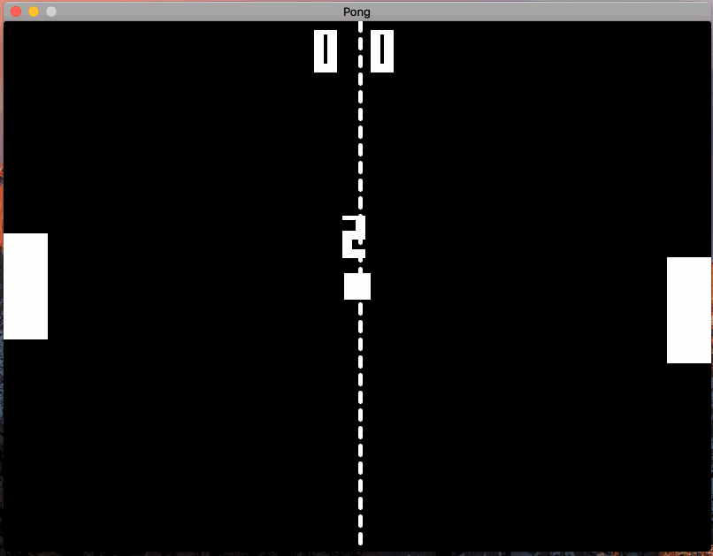

# Pong in SDL



This is an implementation of Pong using SDL 2.0, taking advantage of C++11 features. This project is intended to be cross-platform.

The engine powering this game is meant to be generic enough to adapt to other games, which is one of the reasons why the Pong assets are loaded in as textures rather than just rendered using SDL's basic shapes.

The game features a title screen, working AI, scoring, win/lose conditions, sounds, a main menu, and difficulty settings.

### Dependencies
```sh
brew install sdl2 sdl2_image sdl2_mixer sdl2_ttf
```

### Building and Running

```sh
make game
./game
```